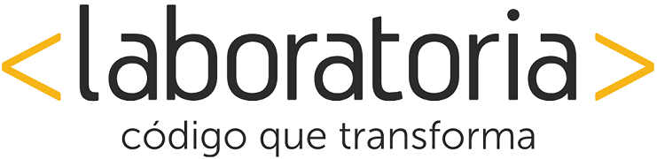

# 1. Mi página

Crea una página web donde se muestre un paisaje y un gatito diferente a medida que la ventana del navegador se haga más pequeña.

### Objetivos

Poner en práctica nuestros conocimientos en media query replicando el siguiente ejercicio: 

### **Alumna**

>##### Stephanie Wong Vega